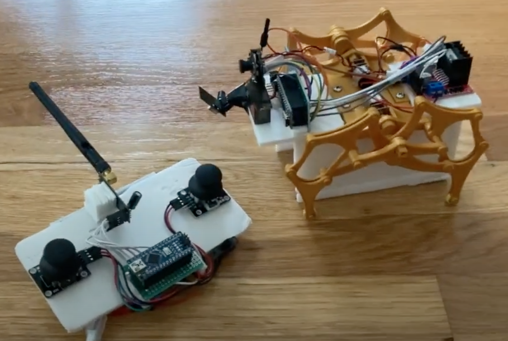
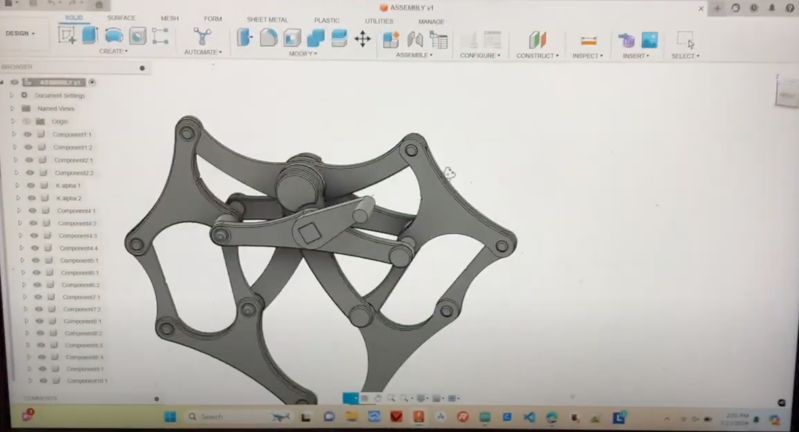

Just a simple Arduino project using the NRF24L01 (radio frequency module). 3D printed the strandbeest mechanism from thingiverse, but added N20 motor brackets to actually drive the legs.

|  |  |
|:----------------------------------------------------------------------:|:-------------------------------------------------------------:|
| Final Product                                                        | CAD Image                                                     |

